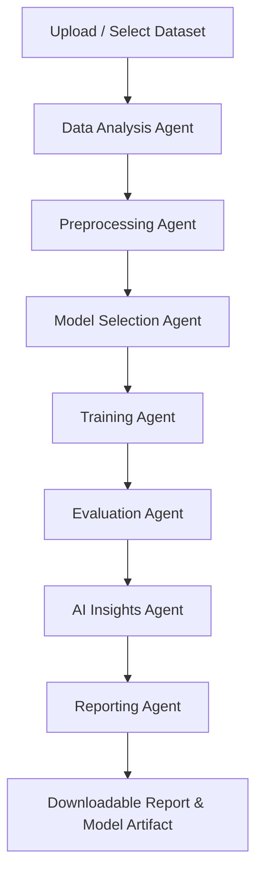

# 🤖 Agentic ML Studio

[](https://www.python.org/)
[](https://langchain-ai.github.io/langgraph/)
[-purple.svg)](https://modelcontextprotocol.io/)
[](https://streamlit.io/)
[](https://scikit-learn.org/)
[](LICENSE)

**Agentic ML Studio** is a modular, multi-agent machine learning studio that automates end-to-end data science workflows. It unites **LangGraph** stateful agent orchestration, **Model Context Protocol (MCP)** tool servers, **scikit-learn** pipelines, and a local **Ollama** LLM backend under an intuitive **Streamlit** multi-page interface.

---

## 📑 Table of Contents

- [Overview](#-overview)
- [Architecture](#-architecture)
- [Key Features](#-key-features)
- [Workflow Pipeline](#-workflow-pipeline)
- [Repository Structure](#-repository-structure)
- [Installation & Quickstart](#-installation--quickstart)
- [Usage Guide](#-usage-guide)
  - [1. Running the Full Multi-Agent Studio](#1-running-the-full-multi-agent-studio)
  - [2. Interactive MCP Pages](#2-interactive-mcp-pages)
  - [3. Running Standalone MCP Servers](#3-running-standalone-mcp-servers)
- [Supported Models](#-supported-models)
- [Testing](#-testing)
- [Storage Artifacts](#-storage-artifacts)
- [Limitations & Roadmap](#-limitations--roadmap)

---

## 🌟 Overview

Building baseline machine learning models often involves repetitive steps: profiling datasets, handling missing values, encoding categories, picking algorithms, training pipelines, calculating metrics, and writing reports.

**Agentic ML Studio** addresses this by deploying specialized, cooperating agents:
1. **Deterministic Operations** (e.g., calculating schema, imputing data, fitting regressors, computing $R^2$/MAE/RMSE) are delegated to **scikit-learn** and **pandas**.
2. **Tool Protocol Integration** is handled via **FastMCP** stdio servers.
3. **Reasoning & Natural-Language Interpretations** are generated using local LLMs (**Ollama / LLaMA 3**) with automated heuristic fallback.
4. **State Management** is coordinated via a compiled **LangGraph** state machine.

---

## 🏗️ Architecture

```
┌─────────────────────────────────────────────────────────────────────────┐
│                           Streamlit Frontend                            │
│  (00_Dataset | 01_Visualizations | 02_Insights | 03_Training | 04_Report│
│                    05_Agentic_Studio Multi-Agent UI)                    │
└────────────────────────────────────┬────────────────────────────────────┘
                                     │
                 ┌───────────────────┴───────────────────┐
                 ▼                                       ▼
┌───────────────────────────────────┐ ┌───────────────────────────────────┐
│     LangGraph Agentic Workflow    │ │        FastMCP Tool Servers       │
│                                   │ │                                   │
│  [Data Analysis Agent]            │ │ • Dataset Server (profile/schema) │
│          ↓                        │ │ • Visualization Server (Plotly)   │
│  [Preprocessing Agent]            │ │ • Training Server (fit/save)      │
│          ↓                        │ │ • Reporting Server (export)       │
│  [Model Selection Agent]          │ └───────────────────────────────────┘
│          ↓                        │
│  [Training Agent]                 │ ┌───────────────────────────────────┐
│          ↓                        │ │         LLM Integration           │
│  [Evaluation Agent]               │ │                                   │
│          ↓                        │ │ • Ollama (llama3)                 │
│  [AI Insights Agent]              │ │ • Resilient Heuristic Fallback    │
│          ↓                        │ └───────────────────────────────────┘
│  [Reporting Agent]                │
└───────────────────────────────────┘
```

---

## ✨ Key Features

### 1. 🤖 Multi-Agent Workflow Orchestration (LangGraph)
- **Data Analysis Agent:** Automatically computes dataset shape, schema data types, missing value distributions, duplicate rows, and numeric summary statistics.
- **Preprocessing Agent:** Dynamically constructs scikit-learn `ColumnTransformer` pipelines with median imputation & standard scaling for numeric features, and mode imputation & one-hot encoding for categorical variables.
- **Model Selection Agent:** Analyzes dataset characteristics (sample size, feature count, categorical presence) to deterministically select the optimal model, or respects explicit user selections.
- **Training Agent:** Executes train-test splitting (80/20) and trains the end-to-end preprocessing + regressor pipeline, persisting models with `joblib`.
- **Evaluation Agent:** Evaluates model predictions on held-out test data, computing genuine $R^2$, MAE, and RMSE metrics.
- **AI Insights Agent:** Interprets data quality, explains error metrics, and provides actionable recommendations using Ollama (`llama3`). Falls back to deterministic heuristics if the LLM is offline.
- **Reporting Agent:** Generates and exports a comprehensive Markdown report summarizing the entire execution.

### 2. 🛠️ Model Context Protocol (MCP) Tool Servers
- Independent FastMCP stdio servers:
  - `dataset_server`: Dataset profiling, schema, missing values, duplicates.
  - `visualization_server`: Interactive Plotly histograms, correlation matrices, and scatter plots.
  - `training_server`: Linear regression fitting and model serialization.
  - `reporting_server`: Markdown report compilation.

### 3. 📊 Interactive Visualizations
- Real-time Plotly rendering of distributions, correlation heatmaps, and customizable scatter plots.

---

## 🔄 Workflow Pipeline



---

## 📁 Repository Structure

```
agentic-ml-studio/
├── .ai/                       # AI coding instructions & workflow specs
├── docs/                      # Project status and documentation
│   └── project_status.md
├── src/
│   └── app/
│       ├── agent/             # LangGraph Multi-Agent Engine
│       │   ├── nodes/         # Individual agent nodes
│       │   │   ├── analysis.py
│       │   │   ├── preprocessing.py
│       │   │   ├── model_selection.py
│       │   │   ├── training.py
│       │   │   ├── evaluation.py
│       │   │   ├── insights.py
│       │   │   └── reporting.py
│       │   ├── state.py       # TypedDict AgentState
│       │   └── workflow.py    # Compiled StateGraph workflow
│       ├── llm/               # Ollama LLM integration & prompt templates
│       │   ├── ollama_client.py
│       │   └── prompts.py
│       ├── mcp/               # Model Context Protocol servers & clients
│       │   ├── client/
│       │   ├── dataset_server/
│       │   ├── reporting_server/
│       │   ├── training_server/
│       │   └── visualization_server/
│       ├── services/          # Supporting services
│       └── ui/                # Multi-page Streamlit application
│           ├── Home.py
│           └── pages/
│               ├── 00_Dataset.py
│               ├── 01_Visualizations.py
│               ├── 02_Insights.py
│               ├── 03_Training.py
│               ├── 04_Reporting.py
│               └── 05_Agentic_Studio.py
├── storage/                   # Saved datasets, models, and reports
│   ├── datasets/
│   ├── models/
│   └── reports/
├── tests/                     # Pytest automated test suite
├── pyproject.toml             # Dependencies and build configuration
└── README.md
```

---

## 🚀 Installation & Quickstart

### Prerequisites
- **Python**: `>= 3.14`
- **uv**: Recommended package manager ([Install uv](https://github.com/astral-sh/uv))
- **Ollama** *(Optional)*: Local LLM runner ([Download Ollama](https://ollama.ai/)). If installed, pull the default model:
  ```bash
  ollama pull llama3
  ```

### 1. Clone & Sync Virtual Environment
```bash
git clone https://github.com/pathummadhusanka/agentic-ml-studio.git
cd agentic-ml-studio
uv sync
```

---

## 🖥️ Usage Guide

### 1. Running the Full Multi-Agent Studio
Launch the Streamlit web application:
```bash
uv run streamlit run src/app/ui/Home.py
```
Open your browser at `http://localhost:8501` and navigate to **`05_Agentic_Studio`**:
1. Select or upload a CSV dataset.
2. Choose your numeric target column.
3. Select a model preference (`Auto` or a specific model).
4. Click **🚀 Run Agentic Workflow**.
5. Inspect real-time agent traces, data quality metrics, trained model performance, AI insights, and download the full Markdown report.

### 2. Interactive MCP Pages
You can also interact with individual stages independently:
- **`00_Dataset`**: Upload and inspect schema, missing values, and duplicate rows.
- **`01_Visualizations`**: Render interactive Plotly histograms, correlation matrices, and scatter plots.
- **`02_Insights`**: Request AI recommendations on data preprocessing.
- **`03_Training`**: Fit baseline linear models.
- **`04_Reporting`**: Export standalone summaries.

### 3. Running Standalone MCP Servers
To run the FastMCP tool servers over stdio for external agent integrations:
```bash
uv run -m app.mcp.dataset_server.server
uv run -m app.mcp.visualization_server.server
uv run -m app.mcp.training_server.server
uv run -m app.mcp.reporting_server.server
```

---

## 📈 Supported Models

| Model Key | Model Name | Description | Best Suited For |
| :--- | :--- | :--- | :--- |
| `linear_regression` | **Linear Regression** | Fast baseline linear model | Small datasets, simple linear relationships |
| `decision_tree` | **Decision Tree Regressor** | Non-linear tree model | Moderate datasets, non-linear interactions |
| `random_forest` | **Random Forest Regressor** | Ensemble of bagging trees | Tabular data with mixed features and noise |
| `gradient_boosting` | **Gradient Boosting Regressor** | Sequential boosting ensemble | Large datasets requiring maximum predictive accuracy |

---

## 🧪 Testing

The repository includes a comprehensive automated test suite testing analysis, preprocessing, model selection, training, evaluation, and end-to-end LangGraph execution.

Run the test suite:
```bash
uv run pytest
```

---

## 💾 Storage Artifacts

Generated artifacts are automatically persisted in the `storage/` directory:
- `storage/datasets/` — Uploaded CSV datasets.
- `storage/models/` — Serialized scikit-learn pipeline artifacts (`.pkl`).
- `storage/reports/` — Exported markdown reports (`.md`).

---

## ⚠️ Limitations & Roadmap

- **Current Scope:** Focuses on tabular regression problems with CSV input.
- **Planned Enhancements:**
  - Support for multi-class and binary classification tasks.
  - Hyperparameter tuning agent (GridSearch / Optuna).
  - External LLM provider support (Gemini, OpenAI, Anthropic) alongside Ollama.
  - Model explainability agent (SHAP / feature importances).

---

## 📄 License

This project is licensed under the MIT License.
